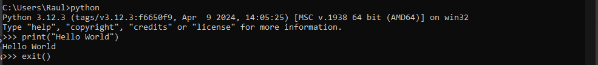
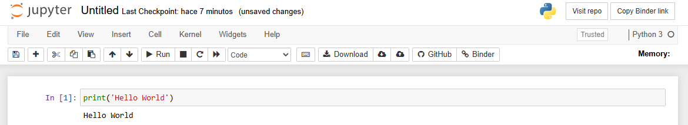

[](https://colab.research.google.com/github/pmRaul/DA-Python/blob/main/01_Python_introduction/01_Python_introduction.ipynb)


# Get Started with Python: Installation and Notebook Basic

Welcome to the first entry in our comprehensive series dedicated to leveraging `Python` for **data analysis**. This series is designed to guide you through the essentials of using `Python` to manipulate, process, clean, and extract valuable insights from various data sources, including images, text, time series, and tabular data. We will start by exploring the fundamental syntax of `Python` and then seamlessly integrate it with a suite of powerful data analysis libraries available in its extensive ecosystem.

One of the key reasons `Python` is favored for data analysis is its **ease of use** coupled with an expansive **ecosystem** of libraries specifically tailored for these tasks. `Python`’s user-friendly syntax makes it accessible to beginners while its rich library support enhances its capabilities. Beyond data analysis, `Python` is versatile enough to handle tasks such as building [web servers](https://flask.palletsprojects.com/en/3.0.x/) with frameworks like Flask, and developing [games](https://www.pygame.org/wiki/GettingStarted) using libraries such as Pygame.

Another significant advantage of `Python` is its role as an integration layer. It can interface with optimized code written in languages like C or C++, which allows for performance enhancements in critical sections of code. This flexibility is evident in advanced fields like Deep Learning, where libraries such as `TensorFlow` and `PyTorch` utilize `Python` for high-level program design while relying on lower-level languages for computationally intensive operations.

While `Python` is a popular choice, alternatives such as `R` and `MATLAB` also play a crucial role in the industry for data analysis. Each language offers unique features and strengths suited to different analytical tasks.

In this series, we will cover the following core libraries:

- `Numpy`: Essential for **numerical computation**, `Numpy` provides efficient data structures and algorithms that are foundational for scientific computing in Python.
- `Pandas`: Offers high-level data structures and functions for manipulating **tabular data**, making data analysis straightforward and efficient.
- `Matplotlib`: A versatile library for generating **graphs and visualizations**, helping to translate data into actionable insights through compelling visual representations.

As we delve into `Machine Learning`, we will explore:

- `Scikit-Learn`: A robust library for building and training classification, regression, and clustering models.
- `TensorFlow` and `PyTorch`: These libraries offer comprehensive tools for defining and training **neural networks** in the realm of `Deep Learning`.

In this initial post, I will guide you through the installation process for `Python` and the necessary tools for developing your programs. Subsequent posts will delve into Python’s syntax and how to effectively utilize the mentioned libraries for data analysis.


## Installing Python 🐍

Let's kick things off by getting `Python` up and running on your computer. You might already have it installed, but it's always good to check. Open your terminal and type `python`. If you see an error message, that means `Python` isn't installed yet. If the **interpreter** opens up, you’re all set and can start coding! If you're not sure how to access the terminal, on `Windows` you can search for `Command Prompt`, and on `MacOS` you should look for `Terminal` (and if you're using `Linux`, I'm sure you’re already familiar with this 😛).

There are several ways to install `Python`, but for data analysis, there’s a particularly handy option: [Anaconda](https://www.anaconda.com/). Anaconda not only installs `Python` but also comes with `conda`, a powerful package manager that makes installing and managing libraries a breeze. It’s like having a Swiss Army knife for data science! 

For a more streamlined approach, I recommend using [Miniconda](https://docs.conda.io/en/latest/miniconda.html). Miniconda installs just `Python` and the `conda` package manager, making it a leaner option. It’s perfect for those who want to start with a minimal setup and then add only the packages you need, optimizing your environment for data analysis. 

In both cases, these tools will simplify the process of managing libraries and environments, ensuring you have everything you need for your data analysis tasks. 📊🔧


### Windows 💻

To install `Miniconda` on `Windows`, start by selecting the installer that matches your system architecture (32-bit or 64-bit). Run the installer and follow the on-screen instructions.

> ⚠️ Important: During installation, make sure to check the option to add `conda` to your `PATH`. Failing to do this might lead to headaches later on when trying to use `conda` from the command line.

For `Python` versions, opt for `version 3` (`Miniconda3`) as `version 2` is no longer supported. All the libraries we'll use in this course are fully compatible with `Python 3`.

### MacOS 🍎

Installing `Miniconda` on `MacOS` is a breeze and quite similar to the Windows process. Download the installer suitable for your system (always choose `version 3`) and follow the provided steps. After installation, you can check that `Miniconda` has been added to your `.bash_profile` file. If it isn’t there, you can manually add it to ensure everything is set up correctly.

### Linux 🐧

For `Linux`, the installation process can vary based on your distribution. For a standard installation on `Ubuntu`, download the appropriate installer from the `Miniconda` website. This will give you a `script` that you can execute using the `bash` command to install `Python` and `conda`. Verify that the installer has updated the `PATH` environment variable in your `.bashrc` file (or `.zshrc` if you’re using the `zsh` shell). If it’s not there, you can add it manually to complete the setup.

With `Miniconda` properly installed, you’re ready to dive into the world of Python and data analysis! 🚀📈

## Hello World 🌟

With `Python` installed, you’re ready to start coding! Open your terminal and launch the **interpreter** by typing `python`. If this command doesn’t work, it might be due to a `PATH` issue (or you may need to restart your computer). Once the interpreter is up and running, it’s time for your first `Python` program.

To write your inaugural program, type the following command:

```python
print("Hello World")
```
Then press `Enter`. You should see the message `Hello World` displayed right in the terminal. 🎉 You’ve just written and executed your first `Python` script!

To exit the interpreter, simply type `exit()` and hit `Enter`. 🚪👋



## Installing Libraries 📦

To install libraries, we typically use the `conda install` command, which is convenient for managing packages within the `conda` environment. This method ensures that packages are compatible with your environment and avoids potential conflicts.

If a particular library isn't available through `conda`, you can turn to `pip`, Python’s default package manager. Simply use the `pip install` command to fetch and install libraries from the Python Package Index (PyPI).

Here’s a quick example:

- To install a library like `numpy` using `conda`, you would run:

  ```bash
  conda install numpy
  ```

- If you need to install a library like requests that isn’t available via conda, you can use pip:

  ```bash
  pip install requests
  ```

Combining both conda and pip allows you to access a broad range of packages and ensures that your data analysis toolkit is fully equipped. Happy coding! 🚀🔧

## Scripting with a Text Editor ✍️🖥️

While working directly from the terminal is useful, most of our programming is done using a text editor. For Python development, there are several great options available, such as [PyCharm](https://www.jetbrains.com/pycharm/) and [VSCode](https://code.visualstudio.com/). In this guide, we will focus on using VSCode.

VSCode (Visual Studio Code) is a powerful IDE (Integrated Development Environment) that not only lets you edit code but also provides a range of features to enhance your coding experience. To get started:

1. **Download and Install VSCode**: Visit the [VSCode website](https://code.visualstudio.com/) and install the appropriate version for your operating system. 🌐
2. **Install the Python Extension**: Once VSCode is installed, open the application and navigate to the Extensions tab (you can find this in the sidebar or by pressing `Ctrl+Shift+X`). Search for the `Python` extension and install it. This extension adds valuable features like code navigation, formatting, linting, and more. 🧩

After setting up VSCode:

1. **Create a New File**: Open VSCode and create a new file named `main.py`. 📝
2. **Write Your First Script**: Enter a simple Python script into your `main.py` file. 🖋️
3. **Run Your Script**: Open the integrated terminal in VSCode by selecting `Terminal` from the top menu and then `New Terminal`. In the terminal, type `python main.py` and hit Enter. You should see the output confirming that your script is working as expected. 🚀

With VSCode and the Python extension set up, you’re ready to dive into scripting and make coding more efficient and enjoyable! 🎉💻


## Jupyter Notebooks 📓

While `VSCode` is a powerful editor for writing and running `Python` code, there's a fantastic tool in the data analysis realm that can greatly enhance your productivity, especially during exploratory analysis. This tool is [Jupyter](https://jupyter.org/). Jupyter allows you to create, edit, and share interactive documents composed of cells where you can seamlessly mix code, text, and visualizations (among other things). In fact, the post you're reading right now was crafted using a Jupyter *notebook* and then exported to a webpage-friendly format!

Here’s how to get started with Jupyter Notebooks:

1. **Install Jupyter**: Open your terminal and run the command `conda install jupyter`. This command will install Jupyter and all necessary components.
2. **Launch Jupyter**: Once the installation is complete, start Jupyter by typing `jupyter notebook` in the terminal. This will open a new browser tab displaying the Jupyter interface where you can manage and create notebooks.
3. **Create a New Notebook**: Click on the `New` button and select the `Python 3 Notebook` option. This will open a fresh notebook where you can start coding.
4. **Run Your First Code**: In the new notebook, type your `Hello World` program into a cell. Run the cell by pressing `Shift + Enter` to see the output.



Jupyter Notebooks are incredibly versatile and user-friendly, making them an excellent tool for both beginners and experienced data analysts. You can learn more about how to use Jupyter Notebooks [here](https://mybinder.org/v2/gh/ipython/ipython-in-depth/master?filepath=binder/Index.ipynb), and we'll dive deeper into their functionality as we explore various data analysis techniques and work through examples together. 🚀📊


## Google Colab ☁️

Let’s wrap up this post by exploring [Google Colab](https://colab.research.google.com/), an excellent tool for running and editing notebooks in the cloud. Google Colab is a free service that allows you to execute code directly on Google’s servers and store your work in *Google Drive*. 

One of the standout features of Colab is its support for `GPU` and `TPU` acceleration, which is incredibly useful when training large neural networks. Training complex models often demands substantial computing power, and having access to GPUs or TPUs can significantly reduce training times. This means you can experiment with more sophisticated models and achieve results faster. 🚀💻

Additionally, Google Colab simplifies sharing *notebooks*. You can easily share your notebooks with others, allowing them to view and interact with your content. This feature is particularly useful for collaboration or educational purposes. For example, to open this post in `Colab` directly, just click the button at the top of the page.

By leveraging Google Colab, you can take advantage of powerful computing resources without the need for expensive hardware, making it an invaluable tool for data scientists and researchers. 🌐🔍


## Summary

In this post, we introduced `Python` for data analysis, one of the most used tools today due to its ease of use and extensive ecosystem of libraries that allow us to perform a wide range of tasks, from data processing to training large neural networks. We covered how to install `Python` via `miniconda` and ran a simple program example in the `Python` interpreter from the terminal. We also introduced developing `Python` programs with the `VSCode` IDE and the `Jupyter` tool, which allows us to create interactive documents where we can run code, add text, visualizations, etc. Finally, we talked about `Google Colab`, a cloud service for storing, editing, running, and sharing our *notebooks* with access to specialized hardware for training large models.

Now that you know what `Python` is and the different ways to work with it for data analysis and *machine learning*, we can start learning the basic elements of the language. See you in the next post.

## Tasks 📦🔧

### Task 1: Install Libraries 📥

**Instructions:**

1. Open your terminal 🖥️.
2. Use `conda` to install the `numpy` library 📦🔢.
3. Use `pip` to install the `requests` library 🌐🔧.


### Task 2: Write Your First Python Script ✍️🚀

**Instructions:**

1. Open VSCode and create a new file named `main.py` 🖥️.
2. Write a script in `main.py` that prints your full name 👤.
3. Run the script from the integrated terminal in VSCode ▶️.

### Task 3: Create and Run Your First Google Colab Notebook ☁️📒

**Instructions:**

1. Open [Google Colab](https://colab.research.google.com/) in your browser 🌐.
2. Create a new notebook by clicking on `File` > `New notebook` 🆕.
3. In the first cell, write and execute code that prints "Hello, Colab!" 👋.
4. Save the notebook to your Google Drive by clicking on `File` > `Save a copy in Drive` 💾.

## Solutions 🛠️

### Task 1: Install Libraries 📥

<details>
  <summary>🔍 Reveal Solution</summary>

```python
!conda install -y numpy
!pip install requests
```
</details>

### Task 2: Write Your First Python Script ✍️🚀

<details>
  <summary>🔍 Reveal Solution</summary>

```python
# In main.py
print("Your Full Name")
```

```bash
# In the VSCode terminal
python main.py
```
</details>

### Task 3: Create and Run Your First Google Colab Notebook ☁️📒

<details>
  <summary>🔍 Reveal Solution</summary>

```python
# In a Google Colab cell
print("Hello, Colab!")
```

</details>


