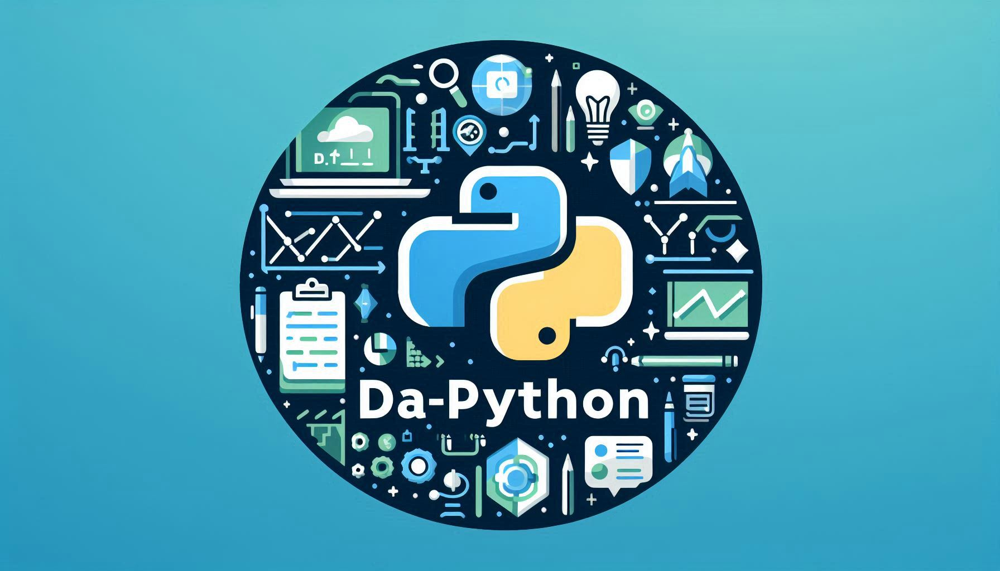

  

<h1 align="center">Data Analysis in Python</h1>

  🎉 A comprehensive guide to learning Python and applying it to data analysis. This course covers everything from basic concepts to advanced techniques like vectorization, data structures, and visualization. Perfect for beginners and professionals looking to enhance their data analysis skills with Python. 🚀

---

## 🌟 What Will You Learn?
- **Installation and Setup:** Learn how to install Python and the essential tools for efficient workflows.
- **Python Fundamentals:** Introduction to the language, including variables, control flow, and functions.
- **Data Structures:** Master lists, tuples, dictionaries, and sets with practical examples.
- **Classes and Objects:** Learn object-oriented programming to create modular and reusable programs.
- **Python Standard Library:** Explore built-in tools like `math`, `os`, `random`, and more.
- **NumPy:** Efficient numerical data manipulation and vectorized operations.
- **Visualization and Advanced Analysis:** Coming soon, including libraries like Matplotlib, Pandas, and Scikit-learn.

---

## 💻 Course Requirements
- **Python 3.7+**
- Recommended installation: [Anaconda](https://www.anaconda.com/) or [Miniconda](https://docs.conda.io/en/latest/miniconda.html) for an optimized environment.
- Suggested Tools:
  - [Google Colab](https://colab.research.google.com/): Cloud-based execution to avoid local setups.
  - [VSCode](https://code.visualstudio.com/): A powerful and user-friendly IDE for Python.

---

## 📖 Table of Contents
1. [Introduction to Python](https://colab.research.google.com/github/pmRaul/DA-Python/blob/main/01_Python_introduction/01_Python_introduction.ipynb)
2. [Python Fundamentals](https://colab.research.google.com/github/pmRaul/DA-Python/blob/main/02_Python_Master_of_the_Basics/02_Python_master_of_the_basics.ipynb)
3. [Python Data Structures](https://colab.research.google.com/github/pmRaul/DA-Python/blob/main/03_Python_mastering_data_structures_lists_tuples_dicts_sets/03_Python_mastering_data_structures_lists_tuples_dicts_sets.ipynb)
4. [Python Functions](https://colab.research.google.com/github/pmRaul/DA-Python/blob/main/04_Python_Functions/04_Python_Functions.ipynb)
5. [Python Classes](https://colab.research.google.com/github/pmRaul/DA-Python/blob/main/05_Python_Classes/05_Python_Classes.ipynb)
6. [Python Standard Library](https://colab.research.google.com/github/pmRaul/DA-Python/blob/main/06_Python_Standard_Library/06_Python_Standard_Library.ipynb)
7. [Introduction to NumPy](https://colab.research.google.com/github/pmRaul/DA-Python/blob/main/07_NumPy/07_NumPy.ipynb)

---

## 🎯 Course Objectives
1. **Master Python:** Learn the basic and advanced syntax of the language.
2. **Understand Data Structures:** From lists to dictionaries, optimize their use.
3. **Efficient Data Manipulation:** Using advanced libraries like NumPy.
4. **Visualize Data:** Transform complex information into comprehensible graphs.
5. **Prepare for Advanced Projects:** Build a solid foundation for modeling and machine learning.

---

## 📚 Additional Resources
- [Official Python Documentation](https://docs.python.org/3/)
- [NumPy: User Guide](https://numpy.org/doc/stable/user/)
- [Google Colab: Getting Started](https://research.google.com/colaboratory/faq.html)

---

## 🚀 Start Your Journey!
This course is designed for you to learn at your own pace. Explore each module and practice with the exercises provided in the links above. Don't hesitate to customize your learning experience and have fun as you master data analysis with Python! 🎉🐍